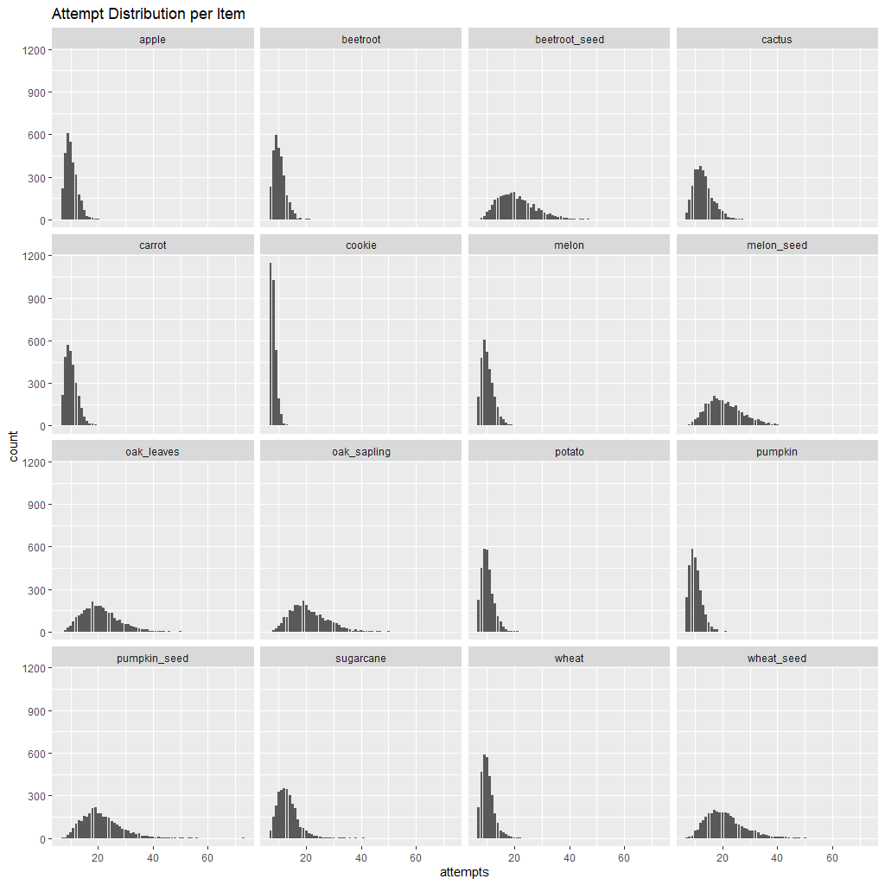
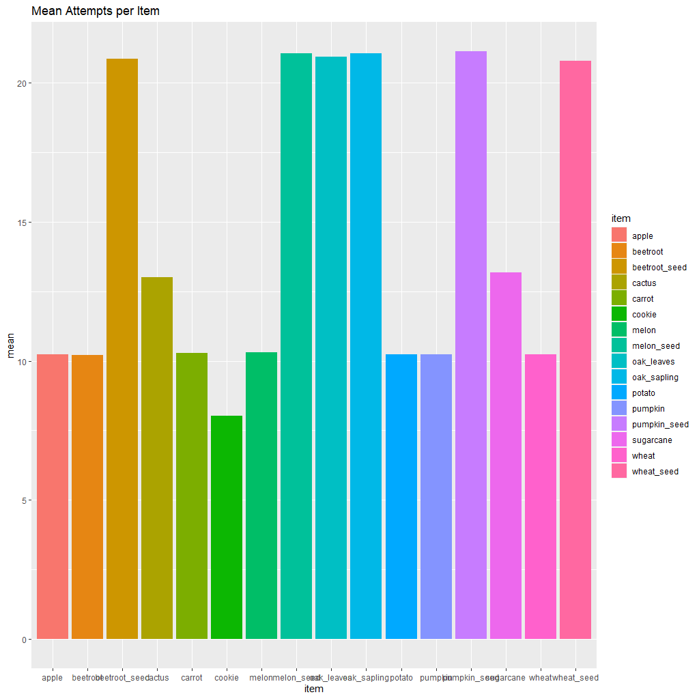

# Minecraft-Composting-Analysis
Analysis of the success rate of items in increasing composter level by 1 when used. <br>
Dataset used: (https://www.kaggle.com/datasets/brandonconrady/minecraft-composting-dataset)

## Environment setup
First install and import the required library
```r{setup}
library(tidyverse)
library(ggplot2)
library(dplyr)
```
## Data Analysis
The next step is to import the cleaned dataset. The raw data was made by [Brandon Conrady](https://www.kaggle.com/datasets/brandonconrady/minecraft-composting-dataset), so thanks a lot :) . 
```r{import-dataset}
dataframe <- read.csv("cleaned.csv")
```
I analyze attempts distrubution per item and the mean attempts of each item to increase the composter level by 1. Here is the resulting charts:




## Conclusion
Among the given items, the cookie has the highest success rate in increasing the composter level by 1. It could be seen by comparing the distribution per item and comparing the max attempts of each item. However, the dataset didn't include several items such as dried kelp, glow berries, kelp and etc. You can refer to the list of items on the [Discussion Section](https://www.kaggle.com/datasets/brandonconrady/minecraft-composting-dataset/discussion/290727). 
